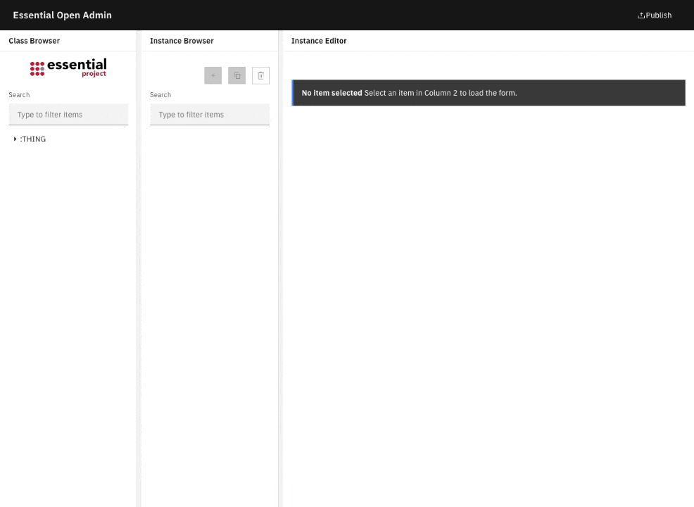

# Essential Open Admin

Web-based administration interface for Essential Open Source, delivered as a single static HTML page served with Nginx in a Docker container.

> Pending: implementation of the Protégé GraphWidget.

This frontend was built to work with the API project [`terryvel/essential-open-api`](https://github.com/terryvel/essential-open-api), which exposes the backend endpoints used here.

## Demo



## Project Structure

- `public/`: Contains the static web files (`index.html`, `the-essential-project.png`).
- `essential_open_admin/`: Contains Docker configuration files (`nginx.conf`, `entrypoint.sh`).
- `Dockerfile`: Configuration for building the Docker image.
- `docker-compose.yml`: Configuration for running the service.

## Prerequisites

- [Docker](https://docs.docker.com/get-docker/)
- [Docker Compose](https://docs.docker.com/compose/install/) (or `docker compose` plugin)

## How to Run

1.  **Build and Start the Container:**

    ```bash
    docker-compose up --build
    ```

    The application will be available at `http://localhost:8080`.

## Configuration

You can configure the following settings using environment variables in the `docker-compose.yml` file or by creating a `.env` file.

| Variable      | Default Value                                         | Description                                           |
| :------------ | :---------------------------------------------------- | :---------------------------------------------------- |
| `API_ORIGIN`  | `http://localhost:5100`                               | The base URL for the API.                             |
| `VIEWER_URL`  | `http://host.docker.internal:9090/essential_viewer` | The default URL for the Essential Viewer publish modal. |
| `VIEWER_USER` | `alice`                                               | The default user for the Publish modal.               |
| `VIEWER_PWD`  | `s3cr3t`                                              | The default password for the Publish modal.           |

### Example: Custom Configuration

To run with a custom API origin:

```bash
API_ORIGIN="http://my-api.com" docker-compose up
```

Or modify `docker-compose.yml` directly.
